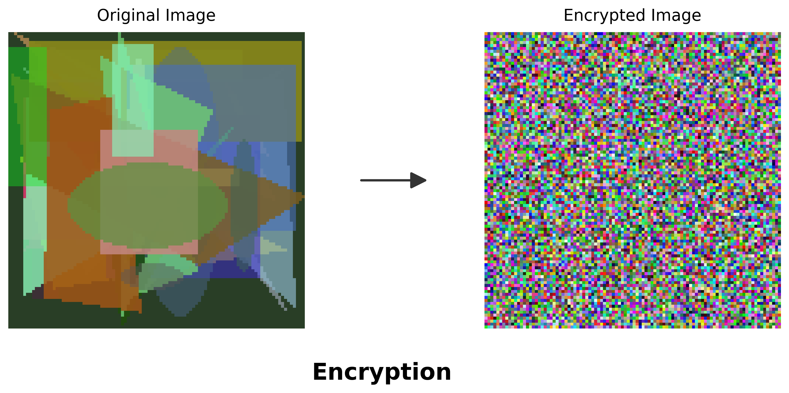

# 图像潜影 (Anti-Seek)

[中文](./readme.md) | [English](./readme_en.md)

这是一个为 ComfyUI 开发的**防检测**与**隐私保护**插件。



### 核心理念

本插件的核心目的是为了防止图像被机器扫描或未授权查看。它引入了**混淆**机制：当解密失败或被探测时，它会伪造出一张随机的几何图形图片，以此迷惑监测系统。

### 核心原理

1.  **噪声加密**：利用 NumPy 生成一层基于特定种子的“数字噪声”，通过异或（XOR）运算将噪声“盖”在原图上。
2.  **哈希校验**：加密时会计算原图的哈希值并存储（`e_info`），解密时用于验证数据完整性。
3.  **安全加盐**：支持用户自定义“盐（Salt）”值，用于混淆随机种子。即使算法公开，不知道盐值也无法还原图片。
4.  **伪造机制**：如果解密时发现哈希不匹配、盐值错误或键名错误，插件将自动生成一张包含随机颜色和几何图形的**伪造图片**，达到混淆视听的效果。

### 加密功能配置

#### 配置文件

编辑 config.json 文件进行配置：

```json
{
    "antiseek_salt": "",
    "antiseek_keyname": "s_tag"
}
```

#### 配置参数说明

1.  **安全加盐 (antiseek_salt)**：设置一个自定义字符串。只有拥有相同盐值的客户端/CLI 才能还原图片。默认为空。
2.  **元数据键名 (antiseek_keyname)**：自定义存储种子的键名（默认为 `s_tag`），防止被轻易扫描定位。

### 命令行工具

如果需要对图片进行解密/加密，可访问[该页面](https://github.com/Echoflare/sd-webui-antiseek/blob/main/tools/cli.py)下载相关脚本。该命令行工具可以将加密的图片还原为原图，也可以对普通图片进行加密。它完全支持用户设置的加盐和键名参数。[在线版本](https://echoflare.github.io/antiseek-web/) (加载Pyodide阶段建议开启魔法上网)

关于命令行工具的使用说明，可查看[此页面](https://github.com/Echoflare/sd-webui-antiseek?tab=readme-ov-file#%E5%91%BD%E4%BB%A4%E8%A1%8C%E5%B7%A5%E5%85%B7-toolsclipy)。